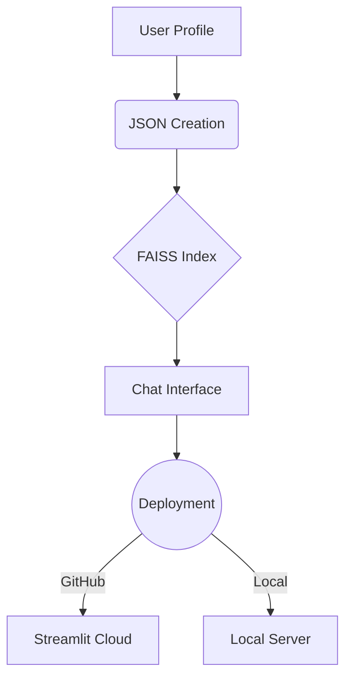

# ChatSynth 🤖✨

**Build Personalized AI Chatbots in Minutes, Absolutely Free, No Signups Required!**  
_Create, Customize, and Deploy AI Assistants Powered by Your Data_

---

## 🚀 Features

- **Profile Builder**: Create structured JSON profiles through an intuitive UI
- **Knowledge Engine**: Automatic FAISS vector store generation
- **One-Click Deployment**: Push to GitHub with Streamlit-ready templates
- **Multi-Model Support**: Choose from leading LLMs (Llama3, Mixtral, etc.)

  

---

## 🛠️ How It Works

1. **Create Profile**: Build a detailed profile through an interactive form
2. **Generate Knowledge**: Convert profile data into searchable vectors
3. **Verify Chat**: Preview how the chatbot responds
4. **Deploy**: Push to GitHub or host locally

---

## 🏁 Getting Started

### Prerequisites
- Python 3.8+
- [HuggingFace Account](https://huggingface.co/)
- [GroqCloud API Key](https://console.groq.com/)

---

## 🧩 Components

| Component | Description | Tech Used |
|-----------|-------------|-----------|
| Profile Builder | Interactive data collection | Streamlit, Pydantic |
| FAISS Engine | Vector store generation | HuggingFace, LangChain |
| Chat Interface | AI conversation handler | Groq, LlamaIndex |
| Deployment | Cloud integration | GitHub API, Streamlit |

---

## 👨💻 Created By

**Vanshaj Raghuvanshi**  

---

## 🤝 Contributing

Contributions are welcome at [ChatSynth](https://github.com/VanshajR/ChatSynth/), open a pull request or issue to get started.

---

## 📜 License

Distributed under the BSD-3.0 License.  
See [LICENSE](https://github.com/VanshajR/ChatSynth/blob/main/LICENSE) for full terms.

---

## 🌟 Support the Project

If you find ChatSynth useful:
- ⭐ **Star** this repository
- 👆 Follow [VanshajR](https://github.com/VanshajR) on GitHub
- 🐛 Report bugs/feature requests via [Issues](https://github.com/VanshajR/ChatSynth/issues)
- 💬 Join the [Discussions](https://github.com/VanshajR/ChatSynth/discussions)

---

**Empowering Personalized AI Experiences Since 2025**  
_Made with ❤️ by [Vanshaj Raghuvanshi](https://github.com/VanshajR)_
